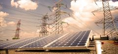

## Article from Union of Concerned Scientists

### Benefits of Renewable Energy Use

*Published Jul 14, 2008 Updated Dec 20, 2017*

>
>Wind turbines and solar panels are an increasingly common sight. But why? What are the benefits of renewable energies—and how do they improve our health, environment, and economy?
>
>This page explores the many positive impacts of clean energy, including the benefits of wind, solar, geothermal, hydroelectric, and biomass. For more information on their negative impacts—including effective solutions to avoid, minimize, or mitigate—see our page on The Environmental Impacts of Renewable Energy Technologies.

[...click for article](https://www.ucsusa.org/resources/benefits-renewable-energy-use)

## Why this Article is Important to Us

It talks about how carbon dioxide is harmful to the environment. It is sustainably sourced and harvested. It will be helpful because we can put it on our website so people can access it and learn about the facts. This will be used in presenting because it is a reliable source.
