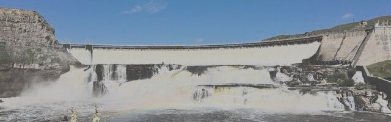

## About CCE

> Citizens for Clean Energy, Inc. (CCE) is a 501(c)3 non-profit organization of Montana citizens from many backgrounds and political persuasions. Our objective is to convince decision makers that adequate, clean, efficient, and cost effective energy for our community, state and region can be obtained without destroying our health, lifestyle, environment and heritage.
>
> We are united by a very deep concern about the harm fossil fuels cause to our environment. With all the wonderful resources available, there are many good solutions for clean power to serve our needs.

[Find out More about CCE](https://www.ccemontana.org/)

## Why We Think the CCE is Important

