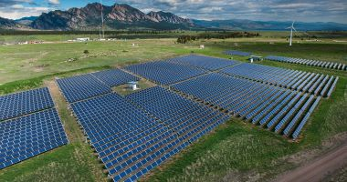

## Clean Energy - Department of Energy

> A clean energy revolution is taking place across America, underscored by the steady expansion of the U.S. renewable energy sector.
>
>The clean energy industry generates hundreds of billions in economic activity, and is expected to continue to grow rapidly in the coming years. There is tremendous economic opportunity for the countries that invent, manufacture and export clean energy technologies.
>
>Responsible development of all of America’s rich energy resources -- including solar, wind, water, geothermal, bioenergy & nuclear -- will help ensure America’s continued leadership in clean energy. Moving forward, the Energy Department will continue to drive strategic investments in the transition to a cleaner, domestic and more secure energy future.

[Clean Energy Information from Energy.gov](https://www.energy.gov/clean-energy)

## Why This Is Important

ENERGY.GOV is the website for the U.S. Department of Energy. They understand the important role that they play in transforming the way the United States consumes energy and reduces carbon emissions.
