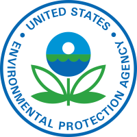

## Energy Resources for State and Local Governments

> ### Overview
>
> Local governments can dramatically reduce their carbon footprint by purchasing or directly generating electricity from clean, renewable sources.
>
> The most common renewable power technologies include:
>
> - Solar (photovoltaic, solar thermal)
> - Wind
> - Biogas (e.g., landfill gas/wastewater treatment digester gas)
> - Geothermal
> - Biomass
> - Low-impact hydroelectricity
> - Emerging technologies - wave and tidal power
>
> Local governments can lead by example by generating energy on–site, purchasing green power, or purchasing renewable energy. Using a combination of renewable energy options can help meet local government goals especially in some regions where availability and quality of renewable resources vary.
>
> Options for using renewable energy include:
>
> - Generating renewable energy on-site using a system or device at the location where the power is used (e.g., PV panels on a state building, geothermal heat pumps, biomass-fueled combined heat and power).
> - Purchasing green power through a green power procurement process that involves the generation of renewable energy certificates (RECs).
> - Purchasing renewable energy from an electric utility through a green pricing or green marketing program, where buyers pay a small premium in exchange for electricity generated locally from green power resources.

[...More information from the EPA](https://www.epa.gov/statelocalenergy/local-renewable-energy-benefits-and-resources)

## Why the EPA and this Guide is important to us

